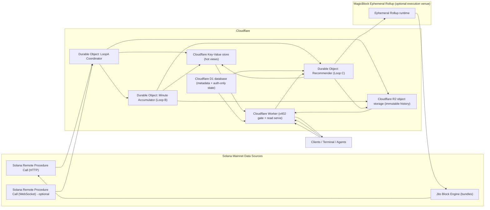

# Loop A + Loop B + Loop C + Execution Venue Architecture (Latency-First, 2026-02-21)

This is an updated version of the Loop architecture document, rewritten with the assumption that **Loop A (v0)** is already implemented **inside the Cloudflare Worker** (cron-triggered), and the next work is to evolve it into a **latency-first pipeline** that supports **Loop B (minute scoring)**, **Loop C (personalized recommendations)**, and an **optional low-latency execution venue** (with MagicBlock Ephemeral Rollups + Jito bundles as the "fast path" options).

It is intentionally written as something you can hand to an implementation agent.

---

## Status summary (what is already true in the code)

### Loop A is already wired into the Worker cron

- The Worker has a `scheduled()` handler that runs Loop A ticks when `LOOP_A_SLOT_SOURCE_ENABLED=1`, and conditionally runs block fetch + decode + canonical state based on env toggles (`LOOP_A_BLOCK_FETCH_ENABLED`, `LOOP_A_DECODER_ENABLED`, `LOOP_A_STATE_STORE_ENABLED`). ([GitHub][1])
- The Worker is cron-triggered every minute in Wrangler config (`crons = ["*/1 * * * *"]`). ([GitHub][2])

### Loop A mechanics (v0)

- SlotSource:
  - reads existing cursor from Cloudflare Key-Value store,
  - fetches Solana heads for processed/confirmed/finalized,
  - writes cursor back,
  - emits backfill tasks for gaps. ([GitHub][3])
- BlockFetcher:
  - builds fetch targets from cursorBefore→cursorAfter,
  - fetches blocks with bounded concurrency + retry,
  - emits "block missing" tasks into Cloudflare Key-Value store. ([GitHub][4])
- CanonicalState (current):
  - persists decoded batches to Cloudflare R2 object storage (with legacy Cloudflare Key-Value store fallback reads during migration),
  - attempts to replay slot-by-slot until it hits a missing slot (then stops). ([GitHub][5])
- MarkEngine v1 (current):
  - computes swap-derived marks from decoded batches,
  - publishes hot keys for `loopA:v1:marks:confirmed:latest` and per-pair latest marks in Cloudflare Key-Value store.
- Health + latency telemetry (current):
  - writes Loop A health artifacts to `loopA:v1:health` in Cloudflare Key-Value store on every tick (success/failure),
  - writes latest tick latency telemetry to `loopA:v1:latency:latest`,
  - persists per-tick health and latency snapshots to Cloudflare R2 object storage when bound.
- Loop B MinuteAccumulator (current):
  - Durable Object ingests Loop A marks incrementally and tracks per-minute revisions in stateful storage,
  - finalizes deterministic minute feature rows with provenance (slot range + input refs) and publishes them to hot Cloudflare Key-Value store,
  - finalizes deterministic, explainable score rows (`loopB:v1:scores:latest` + per-pair score keys) using weighted contribution components,
  - finalizes minute snapshots to hot Cloudflare Key-Value store views (`top_movers`, `liquidity_stress`, `anomaly_feed`, per-pair latest scores, health) with freshness metadata,
  - re-finalizes corrected minutes when late/corrected marks arrive, and writes minute/features/scores/view bundles to Cloudflare R2 object storage.
- Loop C Recommender (current):
  - Durable Object provides request-time personalized ranking with per-minute cache hits for repeated requests,
  - reads bounded candidate pools derived from Loop B minute scores (with score fallback), applies deterministic persona/risk adjustments, and returns ranked recommendation views,
  - candidate pools are published each finalized minute at `loopC:v1:candidates:latest` with Loop B feature/score evidence references,
  - deterministic acceptance model blends cold-start priors with per-pair yes/no feedback and global user feedback state,
  - feedback writes invalidate minute cache and shift acceptance probability predictably for subsequent rankings,
  - hard guardrails suppress candidates by liquidity floor, staleness cutoff, excluded assets, and excluded protocols,
  - ranking includes explicit risk/stability tags and surfaces rejection reason tags for suppressed candidates,
  - Worker now exposes auth-only recommendation APIs at `/api/recommendations/latest` and `/api/recommendations/feedback` with user wallet scoping,
  - personalized recommendation payloads remain unavailable through public x402 routes (`/api/x402/read/*`),
  - persists per-user wallet-scoped latest recommendations to Cloudflare Key-Value store and Cloudflare R2 object storage.

### Execution routing already exists (v0)

There is already an execution router with adapters for:

- "Jupiter"
- "Jito bundle" ([GitHub][6])
- execution contract artifacts now include versioned `ExecutionIntent`, `ExecutionDecision`, `ExecutionLatencyTrace`, and `ExecutionReceipt` records persisted to content-addressed keys in Cloudflare R2 object storage during swap attempts.

---

## What this updated document changes

The original doc assumed loops run as long-lived off-Worker services. That is still a valid deployment topology, but for **ultra low latency inside Cloudflare**, the “tight loop” design should be:

- **Cloudflare Worker** stays the public edge boundary (x402 gating + reads).
- **Cloudflare Durable Objects** become the **single-writer coordination layer** and the **hot aggregation layer** (stateful, in-memory, low-latency).
- **Cloudflare Key-Value store** becomes "latest pointers + small denormalized views" only.
- **Cloudflare R2 object storage** becomes "immutable history + evidence bundles".
- **Cloudflare D1 database** remains "relational metadata, users, auth-only data".

This is not "move everything to Durable Objects." It is:

- **Move the stateful coordination + incremental aggregation to Durable Objects.**
- Keep bulk artifacts and history out of Durable Objects (R2 is the correct surface).

Durable Objects are a good fit here because:

- they give you **single-threaded, ordered execution per object** (critical for correct aggregation),
- they can run background jobs via **alarms** (at-least-once semantics). ([Cloudflare Docs][7])
- they have configurable CPU limits per invocation (default 30 seconds, configurable via Wrangler). ([Cloudflare Docs][8])

---

## Latency targets (explicit)

These are engineering targets, not marketing promises.

### Read path targets (Worker)

- **Worker x402 read endpoint** should do:
  1. authenticate/payment gate,
  2. 1–3 reads from Cloudflare Key-Value store (or a single R2 GET only for "evidence" endpoints),
  3. return JSON.
- Avoid any "scan" patterns (no listing keys, no walking R2 prefixes in request path).

### Compute path targets (Loops)

- **Loop B**: publish "latest minute views" within ~1–2 seconds of the minute boundary (assuming inputs are available).
- **Loop C**: serve "latest recommendations" in a single-digit millisecond CPU budget in Durable Objects (deterministic rules, small candidate set).
- **Execution venue**: provide a fast "decision → submit" path, instrumented end-to-end (see Execution latency section).

---

## Constraints: existing surfaces we must preserve

### Existing API boundary (must not break)

- The Cloudflare Worker (`apps/worker/src/index.ts`) is the public API boundary and contains the existing x402 endpoints. ([GitHub][1])
- Existing endpoints must remain unchanged (paths + payloads + semantics).

### Existing x402 behavior (must not break)

- Each x402 route is `POST` under `/api/x402/read/*`.
- x402 gating behavior stays identical.

---

## Updated high-level system design (latency-first)

### Architectural shape

- **Loop A v0** continues running (already implemented) but we add a **Loop A coordinator Durable Object** to make it robust + low latency.
- **Loop B** becomes an **incremental minute accumulator** (Durable Object) rather than a "read a minute of data, compute, write" batch job.
- **Loop C** becomes an **on-demand + cached ranking service** (Durable Object) with strict privacy boundaries.
- **Execution venue** is a separate component with a Cloudflare intake path and optional MagicBlock + Jito fast paths.

### Conceptual data flow diagram

---

# Loop A (Per-slot truth) — UPDATED

## Loop A v0 (already implemented)

Loop A currently runs in the Worker `scheduled()` handler with this sequence:

1. SlotSource tick updates cursor and emits backfill tasks. ([GitHub][1])
2. BlockFetcher tick fetches blocks between cursorBefore and cursorAfter, with bounded concurrency/retries, emitting missing tasks. ([GitHub][1])
3. DecoderRegistry decodes events (SPL token transfer adapter, Jupiter swap adapter). ([GitHub][9])
4. Canonical state tick persists batches to Cloudflare R2 object storage and replays contiguously until missing slot. ([GitHub][1])

## Loop A v0 latency/reliability bottlenecks (fix list)

### A. Cursor "head" vs "ingestion progress" are conflated

SlotSource sets cursor to heads (max of previous vs new heads). ([GitHub][3])
But canonical replay requires contiguous event batches; if any slot batch is missing, it stops. ([GitHub][5])

**Result:** a single missing slot can stall state advancement even if newer slots are available.

### B. "Missing block" tasks exist but no resolver consumes them

BlockFetcher emits missing tasks, but canonical replay still stalls when missing. ([GitHub][4])

### C. Minute cron scheduling is fundamentally coarse

Cron triggers are great for periodic jobs, but their minimum practical cadence is minutes (your config is 1-minute). ([GitHub][2])
If you want "per-slot truth" that behaves like a real indexer, you need a more responsive trigger mechanism than a minute cron.

---

## Loop A v1 (Latency-first upgrade)

### Principle: separate "observed heads" from "contiguous ingestion cursor"

Define 3 distinct cursor concepts:

- **Observed head cursor:** what Solana reports as processed/confirmed/finalized *right now*.
- **Fetched cursor:** highest slot where we have attempted a block fetch (success or recorded missing).
- **Ingestion cursor:** highest slot where the "event batch exists" (including explicit "empty batch marker" for skipped/missing-in-storage slots) for the chosen commitment.
- **State cursor:** highest slot applied into canonical state snapshot.

You should never publish "state cursor" beyond "ingestion cursor".

### Durable Object: LoopA Coordinator (single-writer)

Create a Durable Object (call it `LoopACoordinator`) that owns the authoritative state machine:

- Stores watermarks in Durable Object storage (not Cloudflare Key-Value store).
- Leases work to stateless tick invocations (Worker scheduled, or explicit HTTP triggers).
- Sets Durable Object alarms to run again **only when there is backlog** (avoid always-on alarms to reduce cost). Cloudflare explicitly recommends not waking up Durable Objects on short intervals unless necessary. ([Cloudflare Docs][10])

> Cloudflare Durable Object alarms provide at-least-once execution and retry behavior. ([Cloudflare Docs][7])

### Explicit "missing slot resolution" policy

When `getBlock` returns null or "skipped / missing in storage," you must be able to advance contiguously *by writing an explicit marker*:

- `loopA:v1:events:<commitment>:slot:<slot>` should be one of:
  - a normal decoded batch, OR
  - an explicit `{ kind: "empty_batch", reason: "skipped" | "missing_in_storage" }`

Then canonical replay can proceed without stalling.

### Move bulk artifacts to Cloudflare R2 object storage

Cloudflare Key-Value store should not be your long-term append log for slot-sized payloads.

**New rule:**

- Cloudflare Key-Value store is "hot pointers + last-N small objects"
- Cloudflare R2 object storage is "immutable history"

A workable pattern:

- Write decoded event batches to Cloudflare R2 object storage, keyed by date/hour/slot.
- Write a small pointer to Cloudflare Key-Value store for "latest confirmed slot", "latest markset", etc.

### Mark computation (needed for Loop B)

Right now Loop A decodes events; to power Loop B you want a "marks stream" that is:

- small,
- frequent,
- easy to aggregate.

At minimum, for swaps you can derive:

- price mark for inMint/outMint,
- confidence based on:
  - whether the swap is Jupiter-routed or direct,
  - size thresholds,
  - data freshness,
  - number of corroborating events.

You already have a `Mark` contract schema in `src/loops/contracts/loop_a.ts`. ([GitHub][11])

---

# Loop B (Minute scoring) — ULTRA LOW LATENCY DESIGN

## Core design change: incremental aggregation, not batch scans

Loop B should not "read the last minute from storage" if you want low latency.

Instead:

- Loop A publishes **stream-like updates** (marks/events) into a Durable Object accumulator.
- The accumulator maintains rolling state in memory (and periodically snapshots).
- On minute boundary, the accumulator finalizes the minute and writes outputs.

### Durable Object: MinuteAccumulator

You can choose keying strategy:

- 1 Durable Object per "pair group" (for example: SOL/USDC, plus a few majors), or
- 1 Durable Object per "protocol", or
- 1 Durable Object for "global top movers + top liquidity stress" (small tracked set)

Do not shard too aggressively early; each Durable Object is operational overhead.

### Minute boundary finalization

MinuteScheduler becomes a logical concept inside the Durable Object:

- Determine `minuteId = YYYY-MM-DDTHH:MM:00Z`
- Maintain `currentMinuteState`
- On minute transition:
  - finalize features,
  - compute scores,
  - publish denormalized views to Cloudflare Key-Value store,
  - persist full minute rows to Cloudflare R2 object storage.

### Output surfaces (strictly optimized for reads)

Write these keys to Cloudflare Key-Value store:

- `loopB:v1:views:top_movers:latest`
- `loopB:v1:views:liquidity_stress:latest`
- `loopB:v1:scores:latest:pair:<pairId>`
- `loopB:v1:health`

Then Worker read endpoints become trivial:

- 1 Cloudflare Key-Value store get
- return payload

---

# Loop C (Personalized recommendations) — ULTRA LOW LATENCY DESIGN

## Core design change: on-demand ranking + minute cache

If you try to compute recommendations for every user every minute, you either:

- spend too much compute, or
- introduce large queues and delays.

Latency-first approach:

- Build a **small global candidate set** each minute (from Loop B).
- On request, rank candidates for the user/wallet in a Durable Object.
- Cache the result per minute in Cloudflare Key-Value store for fast repeat reads.

### Durable Object: Recommender

Keying:

- Durable Object id by `userId:wallet` (strong privacy boundary, clean state isolation), OR
- Durable Object id by `userId` (wallet inside), if you want fewer objects.

The Durable Object does:

- Load persona + constraints from Cloudflare D1 database (or Cloudflare Key-Value store cache).
- Pull candidate set (from Cloudflare Key-Value store).
- Apply deterministic acceptance model + risk/stability guardrails.
- Return ranked list.
- Write latest view to Cloudflare Key-Value store.

### Strict privacy boundary

Personalized recommendations remain **authenticated-only** (not x402 public reads) in MVP.

---

# Execution venue (Low-latency) — OPTIONAL BUT SUPPORTED

This section is new and comes **after Loop C** as requested. It defines a **low-latency execution venue** that can be used by your quant strategies (and later monetized, if desired).

## Fast paths you can support

### Path 1: Solana mainnet execution with Jito bundles

- Jito bundles provide ordered, atomic execution "all or nothing" via Jito Block Engine. ([Helius][12])
- Jito provides low-latency transaction send tooling and stable tip account discovery in their documentation. ([Jito Labs][13])

This path is appropriate when:

- you want priority inclusion / ordering guarantees,
- you are executing real Solana transactions immediately.

### Path 2: MagicBlock Ephemeral Rollup as the execution venue

MagicBlock describes Ephemeral Rollups as a specialized runtime to enhance throughput and enable faster block times and real-time interactions. ([MagicBlock Documentation][14])

This path is appropriate when:

- you want a **very fast internal matching / decision venue**,
- you can accept a "commit back to Solana" settlement model,
- you are building a venue-like mechanism (auction, intent matching, internal order matching).

## Execution venue architecture (conceptual)

- **Worker intake endpoint (authenticated)**:
  - accepts "execution intents" or "strategy orders"
  - validates policy/risk constraints
  - forwards to `ExecutionCoordinator` Durable Object

- **Durable Object: ExecutionCoordinator**
  - maintains per-market auctions (for example: 200 millisecond tick auctions)
  - performs deterministic selection and ordering
  - chooses execution route:
    - "Jito bundle on Solana"
    - "MagicBlock Ephemeral Rollup then commit"

- **Receipts + telemetry**
  - every execution produces an execution receipt persisted to Cloudflare R2 object storage
  - latest receipts and metrics in Cloudflare Key-Value store

---

# Execution latency (instrumentation + optimization plan)

This is the explicit "execution latency section" to implement after Loop C.

## What to measure (minimum viable)

Emit a trace object for every execution attempt:

- `receivedAt` (Worker intake)
- `validatedAt` (policy/risk checks)
- `decisionAt` (strategy decision complete)
- `txBuiltAt`
- `simulatedAt` (if simulation used)
- `sentAt`
- `landedAt` (first observed landing)
- `confirmedAt`
- `finalizedAt`

Also record:

- route used ("Jupiter", "Jito bundle", "MagicBlock Ephemeral Rollup")
- Solana Remote Procedure Call endpoint used
- tip amount (if using Jito)
- error classification

## Where to store

- Cloudflare Key-Value store:
  - `exec:v1:latency:last_100` (bounded ring)
  - `exec:v1:latency:minute:<minuteId>` (aggregates)
- Cloudflare R2 object storage:
  - immutable per-execution receipts

## How to use it

- build internal dashboards
- later monetize: "execution quality analytics" x402 endpoint (optional)

---

# Updated ticket breakdown (Latency-first)

Below are GitHub-issue-sized tickets. Loop A "old part" is treated as implemented; tickets focus on upgrading it and building B/C/Execution.

---

## Loop A upgrade tickets (Latency-first)

### LA-13 — Durable Object LoopA Coordinator (authoritative watermarks + leasing)

**Deliverables**

- New Durable Object `LoopACoordinator`
- Stores watermarks:
  - observed heads
  - fetched cursor
  - ingestion cursor
  - state cursor
- Provides `POST /internal/loop-a/tick` entrypoint callable by cron

**Acceptance criteria**

- Only one coordinator instance decides cursor movement (single-writer)
- Cursor advancement is monotonic and consistent across restarts
- Uses alarms only when backlog exists (no constant wake-ups) ([Cloudflare Docs][10])

---

### LA-14 — Split "head cursor" from "ingestion cursor" + contiguity gate

**Deliverables**

- New cursor schema:
  - `headCursor`
  - `ingestionCursor`
  - `stateCursor`
- Contiguity rules:
  - `ingestionCursor` advances only when a batch exists for every slot in range (including explicit empty markers)

**Acceptance criteria**

- Canonical state never targets a slot beyond contiguous ingestion
- One missing slot no longer stalls forever (it either resolves or becomes an explicit empty marker)

---

### LA-15 — Missing slot resolution: explicit empty markers + skip policy

**Deliverables**

- When `getBlock(slot)` returns null or "skipped," persist an explicit empty batch marker
- Extend replay logic to treat empty marker as present and continue

**Acceptance criteria**

- Canonical replay progresses through skipped slots without breaking
- Missing slots become visible artifacts (auditable)

---

### LA-16 — Move event batch history to Cloudflare R2 object storage, keep Cloudflare Key-Value store hot-only

**Deliverables**

- R2 layout for Loop A events (by date/hour/slot)
- Cloudflare Key-Value store keys become:
  - `latest pointers`
  - last-N batches (optional)

**Acceptance criteria**

- Loop A does not permanently store all batches in Cloudflare Key-Value store
- Worker read endpoints never need to scan Cloudflare R2 object storage

---

### LA-17 — MarkEngine v1 (swap-derived marks) + hot caches

**Deliverables**

- Compute marks from decoded swap events
- Publish:
  - `loopA:v1:marks:confirmed:latest`
  - per-pair latest mark keys

**Acceptance criteria**

- Marks are small, versioned, and explainable (include evidence pointers)
- Marks can be read in one Cloudflare Key-Value store read

---

### LA-18 — Backfill consumer (actually consumes emitted tasks)

**Deliverables**

- Consumer that reads:
  - backfill tasks emitted by SlotSource ([GitHub][3])
  - block missing tasks emitted by BlockFetcher ([GitHub][4])
- Re-fetch + decode + persist results to close gaps

**Acceptance criteria**

- After downtime, system catches up and becomes contiguous again
- Backfill is rate-limited and safe to run continuously

---

### LA-19 — Loop A health + latency telemetry (write once per tick)

**Deliverables**

- Health artifact including lag, error counts, last successful slot/time
- Store in Cloudflare Key-Value store + Cloudflare R2 object storage

**Acceptance criteria**

- Worker `/api/health` can expose loop health without heavy computation

---

## Loop B tickets (Latency-first)

### LB-01 — Durable Object MinuteAccumulator (incremental aggregation)

**Deliverables**

- Durable Object that ingests marks/events continuously
- Maintains rolling minute state in memory + snapshots when needed

**Acceptance criteria**

- Does not scan storage to compute each minute
- Handles reorg-like corrections by versioning inputs and re-finalizing minute if necessary

---

### LB-02 — FeatureExtractor v1 (incremental)

**Deliverables**

- Compute minute features for tracked entities as updates arrive
- Finalize FeatureRows on minute boundary

**Acceptance criteria**

- Features are deterministic and reproducible
- Provenance includes slot range + input references

---

### LB-03 — ScoringEngine v1 (deterministic + explainable)

**Deliverables**

- Rule-based scoring
- Explanation contributions array

**Acceptance criteria**

- Scores are stable for same inputs
- "why" is always present in output

---

### LB-04 — ViewBuilder v1 (Cloudflare Key-Value store optimized views)

**Deliverables**

- `top movers`
- `liquidity stress`
- `anomaly feed`

**Acceptance criteria**

- Each view is small enough to be served instantly from Cloudflare Key-Value store
- Includes freshness metadata

---

### LB-05 — History persistence to Cloudflare R2 object storage

**Deliverables**

- Minute features/scores/views stored in Cloudflare R2 object storage

**Acceptance criteria**

- Backtests and recomputes can be powered from immutable history

---

## Loop C tickets (Latency-first)

### LC-01 — Durable Object Recommender (on-demand rank + per-minute cache)

**Deliverables**

- Durable Object keyed by `userId:wallet` (or `userId`)
- On request:
  - load persona + constraints
  - pull candidate pool
  - compute ranked recommendations
  - write latest to Cloudflare Key-Value store

**Acceptance criteria**

- Request-time ranking is fast and deterministic
- Cached per-minute view prevents repeated recompute

---

### LC-02 — Candidate pool producer (from Loop B outputs)

**Deliverables**

- Each minute, derive a small candidate set (top N opportunities)
- Store candidate pool in Cloudflare Key-Value store

**Acceptance criteria**

- Candidate pool size is bounded and stable
- Candidates include references to Loop B evidence

---

### LC-03 — Acceptance model v1 (deterministic)

**Deliverables**

- Simple Bayesian/logit-like deterministic estimator using yes/no feedback

**Acceptance criteria**

- Cold start works with global priors
- Feedback shifts accept probability predictably

---

### LC-04 — Risk/Stability guardrails (hard filters + penalties)

**Deliverables**

- Hard filters:
  - liquidity minimums
  - stale cutoff
  - excluded assets/protocols
- Penalties/bonuses included in explainability

**Acceptance criteria**

- Risk filters cannot be bypassed
- Rejections include explanation tags

---

### LC-05 — Auth-only APIs (not x402)

**Deliverables**

- `/api/recommendations/latest`
- `/api/recommendations/feedback`

**Acceptance criteria**

- Strong user/wallet authorization
- No personalized payload exposure through `/api/x402/read/*`

---

## Execution venue tickets (Low-latency)

### EX-01 — Execution contracts + receipt schema (versioned)

**Deliverables**

- `ExecutionIntent`
- `ExecutionDecision`
- `ExecutionReceipt`
- `ExecutionLatencyTrace`

**Acceptance criteria**

- Every execution attempt yields a receipt (success or failure)
- Receipt is immutable and content-addressable in Cloudflare R2 object storage

---

### EX-02 — Durable Object ExecutionCoordinator (auction + routing)

**Deliverables**

- Intake from Worker
- Optional auction tick (for example: fixed cadence)
- Routing:
  - Solana Jito bundle path
  - MagicBlock Ephemeral Rollup path

**Acceptance criteria**

- Deterministic selection/ordering given same inputs
- Clear rejection reasons

---

### EX-03 — Jito bundle execution adapter hardening + metrics

**Deliverables**

- Integrate with existing "Jito bundle" adapter route ([GitHub][6])
- Emit latency stages and success/failure classification
- Tip account discovery wired per Jito docs ([Jito Labs][13])

**Acceptance criteria**

- Bundles can be submitted with trace metadata
- "Sent → landed → confirmed" timeline is recorded

---

### EX-04 — MagicBlock Ephemeral Rollup proof-of-concept venue

**Deliverables**

- Minimal program/session flow compatible with Ephemeral Rollups
- Demonstrate one "intent match → commit" loop

**Acceptance criteria**

- Demonstrates the Ephemeral Rollup fast execution concept described in MagicBlock docs ([MagicBlock Documentation][14])
- Produces a receipt and settlement reference

---

### EX-05 — Execution latency telemetry pipeline (storage + dashboards)

**Deliverables**

- Write per-execution receipts to Cloudflare R2 object storage
- Write rolling aggregates to Cloudflare Key-Value store
- Optional: internal dashboard endpoint

**Acceptance criteria**

- You can compute percentiles (P50/P95) by route and by minute
- Data is queryable without scanning Cloudflare R2 object storage in the hot path

---

## Shared / x402 serving tickets (additive only)

### XS-05 — Add Loop-derived x402 read endpoints (additive)

**Deliverables**

- `/api/x402/read/solana_marks_latest`
- `/api/x402/read/solana_scores_latest`
- `/api/x402/read/solana_views_top`

**Acceptance criteria**

- Existing endpoints unchanged
- New endpoints are Cloudflare Key-Value store backed, low-latency, and x402-gated like existing ones

---

## Final note: Cron vs Durable Object alarms

- Cron triggers are ideal for periodic jobs (you are using them today at 1-minute cadence). ([Cloudflare Docs][15])
- Durable Object alarms give you a mechanism to "run again soon when there is work," but Cloudflare explicitly warns that waking objects every few seconds can create unnecessary cost if you do it broadly, so you should design it as **one coordinator object** that wakes only when backlog exists. ([Cloudflare Docs][10])

---

## Implementation sequencing note (current delivery)

To keep risk and rollout controlled, implementation is sequenced as:

1. Loop A reliability/latency upgrades (LA-13 through LA-19)
2. Loop B incremental minute engine (LB-01 through LB-05)
3. Loop C recommender + auth APIs (LC-01 through LC-05)
4. Execution venue hardening (EX-01 through EX-05)

MagicBlock-specific implementation (`EX-04`) is explicitly deferred until the preceding Loop A/B/C and execution tracing foundations are shipped and stable.

[1]: https://raw.githubusercontent.com/GuiBibeau/serious-trader-ralph/main/apps/worker/src/index.ts "raw.githubusercontent.com"
[2]: https://raw.githubusercontent.com/GuiBibeau/serious-trader-ralph/main/apps/worker/wrangler.toml "raw.githubusercontent.com"
[3]: https://raw.githubusercontent.com/GuiBibeau/serious-trader-ralph/main/apps/worker/src/loop_a/slot_source.ts "raw.githubusercontent.com"
[4]: https://raw.githubusercontent.com/GuiBibeau/serious-trader-ralph/main/apps/worker/src/loop_a/block_fetcher.ts "raw.githubusercontent.com"
[5]: https://raw.githubusercontent.com/GuiBibeau/serious-trader-ralph/main/apps/worker/src/loop_a/canonical_state.ts "raw.githubusercontent.com"
[6]: https://raw.githubusercontent.com/GuiBibeau/serious-trader-ralph/main/apps/worker/src/execution/router.ts "raw.githubusercontent.com"
[7]: https://developers.cloudflare.com/durable-objects/api/alarms/?utm_source=chatgpt.com "Alarms - Durable Objects"
[8]: https://developers.cloudflare.com/durable-objects/platform/limits/?utm_source=chatgpt.com "Limits · Cloudflare Durable Objects docs"
[9]: https://raw.githubusercontent.com/GuiBibeau/serious-trader-ralph/main/apps/worker/src/loop_a/decoder_registry.ts "raw.githubusercontent.com"
[10]: https://developers.cloudflare.com/durable-objects/best-practices/rules-of-durable-objects/?utm_source=chatgpt.com "Rules of Durable Objects"
[11]: https://raw.githubusercontent.com/GuiBibeau/serious-trader-ralph/main/src/loops/contracts/loop_a.ts "raw.githubusercontent.com"
[12]: https://www.helius.dev/blog/solana-mev-an-introduction?utm_source=chatgpt.com "Solana MEV: An Introduction"
[13]: https://docs.jito.wtf/lowlatencytxnsend/?utm_source=chatgpt.com "Low Latency Transaction Send — Jito Labs Documentation"
[14]: https://docs.magicblock.gg/pages/get-started/introduction/ephemeral-rollup?utm_source=chatgpt.com "Ephemeral Rollup - MagicBlock Documentation"
[15]: https://developers.cloudflare.com/workers/configuration/cron-triggers/?utm_source=chatgpt.com "Cron Triggers · Cloudflare Workers docs"
