# Loop A + Loop B + Loop C Architecture: Solana Intelligence Pipelines (Trader Ralph)

This document defines how to implement **Loop A (per-slot truth)**, **Loop B (minute scoring)**, and **Loop C (personalized recommendations)** as *agentic, automated processes* that produce **sellable Solana intelligence** while **keeping the existing Worker/x402 endpoints intact**.

It is stored locally at the repo root so it can evolve with implementation decisions.

---

## Context

Trader Ralph already exposes **x402-gated read endpoints** via the Cloudflare Worker (`apps/worker`) and a user-facing terminal (`apps/portal`). Internally, we want three automation tracks:

- **Loop A (per-slot truth):** decode on-chain events → maintain canonical state → emit marks
- **Loop B (minute scoring):** feature extraction → scoring → cacheable views
- **Loop C (personalized recommendations):** rank small investments per user/persona/wallet using behavior + risk + stability controls

The product thesis is: **everything we ingest or can compute can be monetized as x402 endpoints**, as long as it is:
- stable (well-versioned),
- explainable (provenance + “why”),
- fast to serve (KV/R2-backed caches),
- and safe (no secrets, no privileged user data leakage).

---

## Goals

### Primary goals
- Build **slot-level truth** that is robust to RPC hiccups and Solana reorg/finality changes.
- Build **minute-level scoring** that produces *cheap-to-serve* derived artifacts.
- Build **continuous per-user recommendations** for small investments, refreshed on minute cadence and retrievable on-demand.
- Publish artifacts into **Cloudflare KV + R2** so the Worker can serve them behind x402 with low latency.
- Provide a **plugin architecture** so new Solana protocols can be added incrementally.
- Make outputs **first-class data products** (versioned schemas, metadata, provenance).

### Non-goals (for the first iteration)
- Replacing existing live providers used by current endpoints (OHLCV, macro sources) on day 1.
- Full Solana “index everything” coverage immediately. We’ll build a framework + a small set of protocol adapters, then expand.

---

## Constraints and existing surfaces we must preserve

### Existing API boundary
- The **Cloudflare Worker** (`apps/worker/src/index.ts`) is the public API boundary and contains the existing x402 endpoints.
- Existing endpoints must remain unchanged (paths + payloads + semantics).

### Existing x402 behavior (must not break)
- Each x402 route is a `POST` under `/api/x402/read/*`.
- x402 gating is implemented by:
  - returning `402` + `payment-required` header if no `payment-signature` is present,
  - and attaching a settlement `payment-response` header on success.

### Existing endpoint list (keep as-is)
All are `POST` under `/api/x402/read/*`:

**Market**
- `market_snapshot`
- `market_snapshot_v2`
- `market_token_balance`
- `market_jupiter_quote`
- `market_jupiter_quote_batch`
- `market_ohlcv`
- `market_indicators`

**Macro**
- `macro_signals`
- `macro_fred_indicators`
- `macro_etf_flows`
- `macro_stablecoin_health`
- `macro_oil_analytics`

### Important note: bot runtime endpoints are currently removed
The Worker currently returns `410` for `/api/loop/*` and other bot-runtime routes. Loop A/B should be implemented **outside** of the Worker (or in a separate worker), and the existing Worker should primarily remain a **read-serving + payment-gating edge**.

---

## High-level system design

### Architectural shape

- **Loop A**, **Loop B**, and **Loop C** run as **long-lived services** (Bun/Node processes) close to Solana data sources.
- They publish outputs into **Cloudflare KV** (hot / latest / small windows) and **Cloudflare R2** (immutable history, larger payloads).
- The **Worker** reads KV/R2 and exposes the artifacts as **x402 endpoints**.
- Personalized Loop C recommendations are **auth-only** in MVP and are not exposed on public x402 endpoints.

### Data flow diagram (conceptual)

```mermaid
flowchart LR
  subgraph Solana["Solana Mainnet Data"]
    RPC["RPC / WSS (slot + block)"]
    Geyser["(Optional) Geyser gRPC / Yellowstone"]
  end

  subgraph LoopA["Loop A: Per-slot truth (indexer)"]
    SlotSource["SlotSource"]
    BlockFetch["BlockFetcher"]
    Decode["DecoderRegistry + ProtocolAdapters"]
    Reduce["StateReducer (canonical state)"]
    Marks["MarkEngine"]
    AWrite["ArtifactWriter"]
  end

  subgraph LoopB["Loop B: Minute scoring (features + signals)"]
    MinuteTick["MinuteScheduler"]
    Feat["FeatureExtractor"]
    Score["ScoringEngine"]
    Views["ViewBuilder"]
    BWrite["ArtifactWriter"]
  end

  subgraph LoopC["Loop C: Personalized recommendations"]
    CIn["Candidate + User Input Join"]
    Accept["AcceptanceModel (yes/no history)"]
    Guard["Risk/Stability Guardrails"]
    Rank["RecommenderEngine"]
    CWrite["RecommendationPublisher"]
  end

  subgraph Storage["Publishing surfaces"]
    KV["Cloudflare KV (hot views)"]
    R2["Cloudflare R2 (history, evidence)"]
    D1["D1 (small indexes/metadata)"]
  end

  subgraph Edge["Cloudflare APIs"]
    X402["x402 gate + serve"]
    AuthAPI["Auth Recommendation API"]
  end

  Client["Clients / Agents / Terminal"]

  RPC --> SlotSource
  Geyser --> SlotSource
  SlotSource --> BlockFetch --> Decode --> Reduce --> Marks --> AWrite
  AWrite --> KV
  AWrite --> R2
  AWrite --> D1

  KV --> MinuteTick
  R2 --> MinuteTick
  MinuteTick --> Feat --> Score --> Views --> BWrite
  BWrite --> KV
  BWrite --> R2
  BWrite --> D1

  KV --> CIn
  R2 --> CIn
  D1 --> CIn
  CIn --> Accept --> Guard --> Rank --> CWrite
  CWrite --> KV
  CWrite --> R2
  CWrite --> D1

  KV --> X402
  R2 --> X402
  D1 --> X402
  KV --> AuthAPI
  R2 --> AuthAPI
  D1 --> AuthAPI

  X402 --> Client
  AuthAPI --> Client
```



---

## Data products (shared x402 + auth-only personalized APIs)

Think in terms of **datasets** and **views**:

### Loop A datasets
- **Protocol events:** normalized swaps, deposits, borrows, liquidations, mints/burns, fee transfers.
- **Marks:** per-slot marks for assets/pairs (mid, bid/ask, confidence, venue, liquidity).
- **Canonical state snapshots:** tracked pool/market state sufficient to recompute marks and features.

### Loop B datasets
- **Minute bars:** per-asset/pair OHLCV derived from marks/events.
- **Minute features:** per-asset/pair and per-protocol feature vectors.
- **Minute scores:** signal scores with explanations + confidence.
- **Views:** “top movers”, “liquidity stress”, “protocol heatmap”, “anomaly feed”.

### Loop C datasets
- **Candidate investments:** rankable opportunities derived from Loop B scores/features.
- **User preference state:** persona + wallet-scoped recommendation profile and constraints.
- **Recommendation rankings:** per-user/per-wallet scored recommendations with explanations.
- **Recommendation receipts:** pointers to inputs and decision path used to produce each recommendation.

Loop C outputs are served via authenticated APIs in MVP and are not public x402 products.

### Provenance / “receipts”
For any sellable view, we can optionally publish:
- the exact slot/minute range used,
- hashes of input artifacts,
- and a pointer to an R2 “evidence bundle”.

---

## Loop A: Per-slot truth

### Responsibilities
Loop A is an **event-sourced indexer**.

It must:
1. Track a **slot cursor** (processed/confirmed/finalized).
2. Fetch the **block + transaction meta** for slots we care about.
3. Decode tx instructions/logs into **normalized events**.
4. Apply events into **canonical state** (for tracked entities).
5. Compute **marks** (price marks + liquidity marks).
6. Persist outputs + publish hot caches.

### Inputs
Minimum viable:
- `slotSubscribe` (or polling `getSlot`) for new slots
- `getBlock(slot, { transactionDetails: "full", rewards: false, ... })` (or similar) per slot
- token metadata (mint decimals, symbols) from a small registry

Upgrade path:
- Geyser stream for tx/account deltas to reduce RPC load and improve latency.

### Loop A stages and agentic processes

#### A1. SlotSource (continuous, ~400ms cadence)
- Consumes slot notifications (processed + confirmed/finalized updates).
- Produces a stream of `SlotNotification`:

```ts
type SlotNotification = {
  slot: number
  parent?: number
  commitment: "processed" | "confirmed" | "finalized"
  observedAt: string // ISO
}
```

**Frequency:** event-driven, every slot.

#### A2. BlockFetcher (continuous, bounded concurrency)
- Ensures each “target slot” is fetched exactly once per commitment tier.
- Handles retries, backoff, and gap detection.

Key behavior:
- Maintain a **slot queue** with watermarks:
  - `headProcessed` (fast)
  - `headConfirmed` (more stable)
  - `headFinalized` (authoritative)
- Don’t attempt to fully “finalize” a slot until the chain reports it finalized.

**Frequency:** event-driven, usually one fetch per slot (sometimes multiple if you want both processed and confirmed copies).

#### A3. DecoderRegistry + ProtocolAdapters (continuous)
- For each transaction:
  - parse instructions + logs,
  - route to protocol adapters by program id(s),
  - emit `ProtocolEvent[]`.

##### Protocol adapter interface
Adapters are the unit of extensibility.

```ts
type ProtocolEvent =
  | { kind: "swap"; protocol: string; slot: number; sig: string; user?: string; inMint: string; outMint: string; inAmount: string; outAmount: string; venue?: string; ts: string; meta?: Record<string, unknown> }
  | { kind: "liquidity_add"; protocol: string; /* ... */ }
  | { kind: "liquidity_remove"; protocol: string; /* ... */ }
  | { kind: "borrow" | "repay" | "liquidation"; protocol: string; /* ... */ }
  | { kind: "mint" | "burn"; protocol: string; /* ... */ }
  | { kind: "fee_transfer"; protocol: string; /* ... */ }
  | { kind: "unknown"; protocol: string; /* ... */ };

interface ProtocolAdapter {
  id: string
  programIds: string[]              // on-chain program IDs
  decode(tx: DecodingContext): ProtocolEvent[]
  reduce?(state: CanonicalState, ev: ProtocolEvent): CanonicalState
  marks?(state: CanonicalState, slot: number): Mark[]
}
```

**MVP adapter set (suggested):**
- SPL Token transfers (net flows)
- Jupiter aggregator routed swaps (flow + price evidence)
- One major AMM pool type (Orca Whirlpools OR Raydium CLMM) for pool-derived marks

**Frequency:** per transaction.

#### A4. StateReducer (continuous)
- Applies events to canonical state.
- Keeps:
  - finalized state
  - a small unfinalized window (ring buffer) for rollback

**State strategy:**
- Event-sourced with checkpointing:
  - Apply events into in-memory state
  - Every N slots, write snapshot
  - On restart: load snapshot + replay events

#### A5. MarkEngine (continuous)
Marks are *opinions about price + liquidity* at a given slot.

```ts
type Mark = {
  slot: number
  ts: string
  baseMint: string
  quoteMint: string
  px: string                 // decimal string (base in quote)
  bid?: string
  ask?: string
  confidence: number         // 0..1
  venue: string              // "orca" | "raydium" | "jupiter" | ...
  liquidityUsd?: string
  evidence?: {
    sigs?: string[]
    pools?: string[]
    inputs?: string[]        // references to stored artifacts
  }
  version: string            // schema version
}
```

**Design principle:** marks should always include enough metadata to trace their origin.

#### A6. ArtifactWriter + Publisher (continuous + periodic)
Persist:
- raw normalized events (immutable)
- marks per slot (immutable)
- periodic snapshots of canonical state (immutable)
Publish (hot caches):
- latest slot, latest marks, small rolling windows

---

### Finality and reorg handling (critical)

Solana can have short-lived forks at `processed` and sometimes `confirmed`. Loop A must:

- Treat `finalized` as the only fully authoritative state.
- Keep an **unfinalized buffer** (e.g., last 256 slots):
  - store per-slot event lists
  - store per-slot state diffs (or recompute via replay)
- If a slot is superseded, **rollback** that window and rebuild from last finalized snapshot.

Practical approach (simple and robust):
1. Only *publish* marks as “authoritative” after `confirmed` (or `finalized`).
2. Still ingest `processed` for low-latency previews, but tag them clearly (`commitment` field).
3. Maintain two caches:
   - `latest_processed`
   - `latest_confirmed` (preferred for sale)

---

### Persistence + storage layout

#### KV (hot / latest / small payloads)
Key naming should be stable and versioned.

Examples:
- `loopA:v1:cursor` → `{ processed: 123, confirmed: 120, finalized: 118, updatedAt: ... }`
- `loopA:v1:marks:confirmed:latest` → `{ slot, ts, marks: Mark[] }`
- `loopA:v1:marks:confirmed:byMint:<mint>` → last mark for a mint
- `loopA:v1:health` → lag, errors, last successful slot, etc.

TTL guidelines:
- “latest” keys: short TTL (1–5 minutes) but continuously refreshed
- rolling windows (e.g., last 60 minutes): longer TTL (1–6 hours)

#### R2 (immutable history + evidence bundles)
Object naming should support partitioned retrieval and lifecycle policies.

Examples:
- `loopA/v1/events/date=YYYY-MM-DD/hour=HH/slot=<slot>.jsonl.gz`
- `loopA/v1/marks/date=YYYY-MM-DD/hour=HH/slot=<slot>.json.gz`
- `loopA/v1/snapshots/slot=<slot>.json.gz`
- `loopA/v1/evidence/slot=<slot>/markset=<hash>.json.gz`

Compression:
- JSONL + gzip works well for append-heavy event logs.

---

### Loop A frequencies (target)

| Subprocess | Trigger | Typical cadence | Notes |
|---|---:|---:|---|
| SlotSource | WSS/Geyser | ~400ms/slot | mainnet slots vary |
| BlockFetcher | slot arrival | ~1 block fetch/slot | bounded concurrency + retry |
| Decode + Reduce | per block | per slot | depends on tx volume |
| MarkEngine | per slot | per slot | produce markset |
| Snapshot | slot counter | every ~100–300 slots | choose by cost |
| Publish hot caches | on new confirmed slot | per slot | tiny payloads only |
| Backfill worker | gaps detected | continuous until caught up | rate-limited |

---

## Loop B: Minute scoring

Loop B turns raw truth into **structured, cacheable intelligence**.

### Responsibilities
1. Read Loop A marks/events over a minute window.
2. Build per-entity **feature vectors**.
3. Compute **scores/signals** + **explanations**.
4. Publish **views** optimized for API reads.
5. Persist outputs for replay/backtest.

### Inputs
- Loop A “confirmed” marks stream
- Loop A event stream (swaps, transfers, protocol actions)
- Optional macro + off-chain feeds (later)

### Loop B stages and agentic processes

#### B1. MinuteScheduler (every minute, aligned)
- Trigger exactly on the minute boundary (or with small delay).
- Define `minuteStart`, `minuteEnd` and a watermark.

```ts
type MinuteWindow = {
  minute: string // ISO minute "2026-02-20T04:37:00Z"
  startTs: string
  endTs: string
  sourceFinality: "confirmed" | "finalized"
}
```

**Frequency:** every 60 seconds.

#### B2. FeatureExtractor (per minute)
Compute features for tracked entities.

Entity types:
- token mint (SOL, USDC, etc)
- pair (SOL/USDC)
- protocol (jupiter/orca/…)
- pool/market (specific address)

Feature families (MVP):
- price returns (1m, 5m, 1h)
- realized volatility (rolling)
- volume and trade count
- buy/sell imbalance
- net flow (token transfers)
- liquidity proxy (pool depth / spread proxy)
- “staleness” / missing data flags

Output schema:

```ts
type FeatureRow = {
  minute: string
  entityType: "mint" | "pair" | "protocol" | "market"
  entityId: string
  features: Record<string, number>
  featureVersion: string
  inputs: {
    slotRange?: [number, number]
    artifactRefs?: string[]
  }
}
```

#### B3. ScoringEngine (per minute)
A scoring engine turns features into signals.

Design constraints:
- deterministic (for reproducibility)
- versioned
- explainable

Output schema:

```ts
type ScoreRow = {
  minute: string
  entityType: FeatureRow["entityType"]
  entityId: string
  scores: Record<string, number> // e.g. momentum, meanrev, risk, liquidity
  confidence: number
  explain: Array<{ name: string; contribution: number; note?: string }>
  scoreVersion: string
}
```

#### B4. ViewBuilder (per minute)
Views are denormalized objects optimized for endpoints.

Examples:
- “top movers” for last minute / last hour
- “top protocol volume changes”
- “liquidity stress dashboard”
- “anomaly feed” (feature thresholds)

Views should include:
- `generatedAt`
- `minute`
- `dataFreshness`
- references to inputs (for provenance)

#### B5. ArtifactWriter + Publisher
Persist:
- features (immutable)
- scores (immutable)
- views (immutable)

Publish:
- latest views and per-entity last score into KV.

---

### Loop B persistence layout

#### KV (hot views)
Examples:
- `loopB:v1:scores:latest:pair:So111..../USDC...` → last `ScoreRow`
- `loopB:v1:views:top_movers:latest` → top N movers
- `loopB:v1:views:protocol_heatmap:latest`

TTL:
- latest: 5–30 minutes
- rolling views: 1–6 hours

#### R2 (history)
Examples:
- `loopB/v1/features/date=YYYY-MM-DD/hour=HH/minute=<minute>.jsonl.gz`
- `loopB/v1/scores/date=YYYY-MM-DD/hour=HH/minute=<minute>.jsonl.gz`
- `loopB/v1/views/date=YYYY-MM-DD/hour=HH/minute=<minute>.json.gz`

---

### Loop B frequencies (target)

| Subprocess | Trigger | Cadence | Notes |
|---|---:|---:|---|
| MinuteScheduler | wall clock | 60s | align to minute boundary |
| Feature extraction | scheduler | 60s | compute for tracked entities |
| Scoring + views | scheduler | 60s | deterministic + versioned |
| Publish KV | after compute | 60s | keep payloads small |
| Backfill minutes | gaps detected | every 5–15 min | rate-limited |
| Recompute (version bump) | manual | ad-hoc | uses history in R2 |

---

## Loop C: Personalized recommender

Loop C turns market intelligence into **continuous, per-user small-investment recommendations**.

### Responsibilities
1. Join Loop B outputs with user persona, wallet context, and acceptance history.
2. Generate candidate investments and size suggestions within risk bounds.
3. Compute recommendation scores + explanations using deterministic rules.
4. Apply hard risk/stability guardrails before ranking.
5. Publish per-user recommendation views for authenticated API consumption.
6. Ingest feedback (`yes`/`no`) to continuously adapt acceptance estimates.

### Inputs
- Loop B scores/views/features
- user persona profile
- wallet holdings + constraints
- historical recommendation feedback (`yes`/`no`)
- curiosity/risk/stability feature inputs

### Outputs
- ranked recommendations per user + wallet
- confidence + explanation factors
- freshness metadata + evidence pointers

### Loop C data contracts (MVP)

```ts
type UserPersona = {
  userId: string
  wallet: string
  riskBudget: "low" | "medium" | "high"
  horizon: "intraday" | "swing" | "position"
  sectorPreferences: string[]
  excludedAssets: string[]
}

type AcceptanceEvent = {
  userId: string
  recommendationId: string
  decision: "yes" | "no"
  decidedAt: string // ISO
  reason?: string
}

type CandidateInvestment = {
  candidateId: string
  assetOrPair: string
  suggestedAction: "buy" | "reduce" | "hold"
  sizeUsd: number
  inputsRef: string[]
  riskFlags: string[]
  stabilityFlags: string[]
}

type RecommendationScoreRow = {
  userId: string
  wallet: string
  minute: string
  candidateId: string
  baseSignal: number
  acceptProb: number
  curiosity: number
  riskPenalty: number
  stabilityBonus: number
  finalScore: number
  explain: Array<{ name: string; contribution: number; note?: string }>
  modelVersion: string
}

type RecommendationView = {
  generatedAt: string
  minute: string
  userId: string
  wallet: string
  recommendations: Array<{
    candidateId: string
    assetOrPair: string
    suggestedAction: "buy" | "reduce" | "hold"
    sizeUsd: number
    finalScore: number
    confidence: number
    explain: RecommendationScoreRow["explain"]
  }>
  freshnessMs: number
}
```

### Simple recommender formula (deterministic)

`finalScore = w1*baseSignal + w2*acceptProb + w3*curiosity + w4*stabilityBonus - w5*riskPenalty`

Hard pre-filters before ranking:
- max position size (wallet and risk-budget aware)
- min liquidity threshold
- excluded asset/protocol filters from persona/policy
- stale-data cutoff for Loop B inputs

### Loop C stages and agentic processes

#### C1. CandidateAssembler (per minute)
- Builds candidate list from Loop B top signals and eligible assets/pairs.
- Computes preliminary size suggestions from persona risk budget + wallet constraints.

#### C2. UserStateLoader (per minute + on-demand)
- Loads user persona, wallet profile, and rolling behavior features.
- Supports optional request-time persona overrides for simulation/re-ranking.

#### C3. AcceptanceModel (per minute)
- Estimates `acceptProb` from past `yes`/`no` outcomes.
- MVP: deterministic Bayesian/logit-style estimator with global priors for cold-start users.

#### C4. Risk/StabilityGuard (per minute)
- Applies hard constraints and penalties:
  - risk concentration checks
  - liquidity/stability requirements
  - data freshness checks
- Rejected candidates are excluded with explanation tags.

#### C5. RecommenderEngine (per minute)
- Computes `finalScore` and ranked list.
- Emits explainability contributions for each recommendation.

#### C6. ViewPublisher + FeedbackIngest (continuous)
- Publishes latest recommendations to hot caches and immutable history.
- Ingests `/feedback` decisions and updates user behavior state.

### Loop C API contract (auth-only MVP)

Loop C personalized outputs are not public x402 endpoints in MVP.

#### `POST /api/recommendations/latest`
- auth required
- Request body:

```json
{
  "wallet": "<wallet>",
  "limit": 5,
  "riskMode": "balanced",
  "personaOverride": {
    "riskBudget": "medium",
    "excludedAssets": ["BONK"]
  }
}
```

- Response body:

```json
{
  "ok": true,
  "view": {
    "generatedAt": "2026-02-20T04:37:00Z",
    "minute": "2026-02-20T04:37:00Z",
    "userId": "usr_123",
    "wallet": "<wallet>",
    "recommendations": [
      {
        "candidateId": "rec_abc",
        "assetOrPair": "SOL/USDC",
        "suggestedAction": "buy",
        "sizeUsd": 120,
        "finalScore": 0.84,
        "confidence": 0.78,
        "explain": [
          { "name": "baseSignal", "contribution": 0.36 },
          { "name": "acceptProb", "contribution": 0.22 }
        ]
      }
    ],
    "freshnessMs": 2300
  }
}
```

#### `POST /api/recommendations/feedback`
- auth required
- Request body:

```json
{
  "wallet": "<wallet>",
  "recommendationId": "rec_abc",
  "decision": "yes",
  "reason": "Fits my current risk budget"
}
```

- Response body:

```json
{
  "ok": true,
  "feedbackAccepted": true,
  "updatedModelVersion": "loopC-v1"
}
```

### Loop C persistence layout

#### KV (hot per-user latest)
Examples:
- `loopC:v1:recs:latest:user:<userId>:wallet:<wallet>`
- `loopC:v1:recs:latest_ptr:user:<userId>:wallet:<wallet>`

TTL:
- latest recommendation views: 1–15 minutes
- latest pointers: 1–5 minutes

#### R2 (history + evidence)
Examples:
- `loopC/v1/recommendations/date=YYYY-MM-DD/hour=HH/minute=<minute>/user=<userId>.json.gz`
- `loopC/v1/feedback/date=YYYY-MM-DD/hour=HH/user=<userId>.jsonl.gz`
- `loopC/v1/evidence/minute=<minute>/user=<userId>/recset=<hash>.json.gz`

#### D1 (authoritative metadata)
Suggested tables:
- `loop_c_recommendations`
- `loop_c_feedback`
- `loop_c_user_state`
- `loop_c_pointers`

### Loop C frequencies (target)

| Subprocess | Trigger | Cadence | Notes |
|---|---:|---:|---|
| CandidateAssembler | Loop B minute close | 60s | builds candidate pool |
| UserStateLoader | scheduler + API request | 60s + on-demand | supports persona overrides |
| AcceptanceModel | scheduler | 60s | updates `acceptProb` |
| Risk/StabilityGuard | scheduler | 60s | hard pre-filters + penalties |
| RecommenderEngine | scheduler | 60s | deterministic ranking |
| ViewPublisher | scheduler | 60s | writes per-user views |
| FeedbackIngest | API calls | event-driven | updates behavior state |

---

## Worker + x402 integration strategy

### Principle
- **Worker remains the monetization/edge layer.**
- **Loop services write artifacts into KV/R2.**
- **Worker reads artifacts and wraps them with x402 payment gating.**
- **Loop C personalized recommendations are served via authenticated endpoints only (MVP).**

### How to add new x402 endpoints without breaking existing ones
1. Add a new route handler in `apps/worker/src/index.ts` under `/api/x402/read/...`.
2. Add a new `X402RouteKey` in `apps/worker/src/x402.ts`.
3. Add an env var for pricing in `apps/worker/wrangler.toml` (and prod secrets).
4. Write tests similar to the existing x402 integration tests.

### Endpoint design options

#### Option A: “Named endpoints” (recommended for MVP)
Create a small set of stable endpoints:

- `/api/x402/read/solana_marks_latest`
- `/api/x402/read/solana_events_recent`
- `/api/x402/read/solana_scores_latest`
- `/api/x402/read/solana_views_top`

Pros:
- simple pricing and caching
- stable contracts
- easy to market

Cons:
- lots of endpoints as catalog grows

#### Option B: “Generic dataset endpoint” (good for long-tail)
A single endpoint:

`/api/x402/read/dataset`

Body:
```json
{
  "dataset": "loopB.views.top_movers",
  "version": "v1",
  "params": { "window": "1h" }
}
```

Pros:
- scales to many datasets
- fewer worker changes

Cons:
- needs pricing tiers and abuse controls

You can do **both**: named endpoints for flagship products + generic endpoint for long tail.

### Suggested response envelope for loop-derived endpoints
Keep `{ ok: true }` and add a standard `meta` object:

```json
{
  "ok": true,
  "data": { /* view payload */ },
  "meta": {
    "schemaVersion": "v1",
    "generatedAt": "2026-02-20T04:37:00Z",
    "finality": "confirmed",
    "slotRange": [123, 456],
    "cache": { "layer": "kv", "hit": true },
    "evidence": { "r2Key": "loopB/v1/views/..." }
  }
}
```

---

### Authenticated recommendation serving (Loop C)

Loop C endpoints are not public x402 routes in MVP:
- `/api/recommendations/latest`
- `/api/recommendations/feedback`

Rules:
- require authenticated user context for every request
- enforce user/wallet ownership checks
- never expose user-specific recommendation payloads through `/api/x402/read/*`
- include freshness and provenance metadata in the auth response body

---

## Operational model

### Deployment topology
- **Loop A/B/C runners:** long-lived process (container/VM). Needs:
  - Solana RPC/WSS (or Geyser) access
  - Cloudflare API token (write to KV/R2)
  - auth-aware data store access for Loop C user state and feedback
- **Worker:** unchanged deployment via Wrangler.

### Configuration
- Store loop configs in `CONFIG_KV`:
  - tracked mints/pairs
  - protocol adapters enabled
  - snapshot cadence
  - scoring parameters and model versions
  - Loop C weight set (`w1..w5`)
  - Loop C policy thresholds (max size, min liquidity, stale cutoff)

### Observability
- KV health keys (`loopA:v1:health`, `loopB:v1:health`, `loopC:v1:health`)
- R2 log bundles for:
  - decoder errors
  - missing slot gaps
  - scoring anomalies
  - recommendation reject reasons + feedback ingestion errors

### Privacy and security controls (must-have for Loop C)
- user data isolation by `userId + wallet` keyspace
- audit log for recommendation reads and feedback writes
- strict boundary: no user-specific payloads to public x402 endpoints
- redact sensitive user metadata from R2 evidence bundles

### Data integrity checks (must-have)
- Slot continuity checks (no gaps) for confirmed/finalized cursors
- “mark freshness” checks
- schema version compatibility checks between producer and Worker
- recommendation determinism checks (same inputs => same ranking order)
- feedback ingestion idempotency checks (duplicate event handling)

---

# Ticket breakdown

Below are implementation tickets sized to be GitHub issues. IDs are suggestions.

---

## Loop A tickets (per-slot truth)

### LA-01 — Define Loop A data contracts + versioning
**Deliverables**
- `ProtocolEvent`, `Mark`, `StateSnapshot`, `Health` schemas (TS + JSON schema)
- Versioning plan (`v1`, `v1.1` etc)

**Acceptance criteria**
- Can serialize/deserialize contracts with runtime validation
- Each artifact includes `schemaVersion` and `generatedAt`

---

### LA-02 — SlotSource + cursor store
**Deliverables**
- Slot subscription adapter (WSS or polling)
- Cursor state persisted (so restart resumes safely)

**Acceptance criteria**
- Maintains processed/confirmed/finalized cursors
- Detects gaps (missed slot numbers) and emits backfill tasks

**Frequency**
- event-driven (~every slot)

---

### LA-03 — BlockFetcher with bounded concurrency + retries
**Deliverables**
- Block fetch pipeline for slots
- Retry policy + backoff + error classification

**Acceptance criteria**
- Fetches blocks for targeted commitment level(s)
- Does not overload RPC (configurable concurrency)
- Emits “block missing” events to backfill worker

---

### LA-04 — DecoderRegistry + ProtocolAdapter plugin system
**Deliverables**
- Registry keyed by `programId`
- Adapter interface + loader
- MVP adapters:
  - SPL token transfer flow decoder
  - Jupiter routed swap decoder (or minimal “swap inferred from logs” decoder)

**Acceptance criteria**
- Adding a new protocol adapter is a single new module + registration
- Emits normalized `ProtocolEvent[]` for real blocks

---

### LA-05 — CanonicalStateStore (event-sourced) + snapshotting
**Deliverables**
- In-memory canonical state store
- Snapshot writer every N slots
- Snapshot loader on startup + replay events since snapshot

**Acceptance criteria**
- Restart recovers state to last known cursor
- Snapshots are versioned and reference their input slot

---

### LA-06 — MarkEngine v1 (slot marks)
**Deliverables**
- Mark computation pipeline using state + events
- Confidence scoring + evidence pointers

**Acceptance criteria**
- Produces marks for configured mint/pairs each slot
- Marks include `confidence`, `venue`, and `evidence` references

**Frequency**
- per slot (confirmed preferred)

---

### LA-07 — Finality + rollback handling
**Deliverables**
- Unfinalized ring buffer for last N slots
- Rollback + rebuild logic when fork detected

**Acceptance criteria**
- If parent mismatch is detected in the unfinalized window, system rolls back to last finalized snapshot and replays
- Published KV “confirmed latest” never regresses

---

### LA-08 — ArtifactWriter to KV + R2 (Loop A)
**Deliverables**
- R2 object layout for events/marks/snapshots
- KV keys for hot caches

**Acceptance criteria**
- Writes compressed JSON/JSONL to R2 with deterministic keys
- KV contains `latest` pointers and last marksets

---

### LA-09 — Backfill worker for missing slots
**Deliverables**
- Backfill queue + worker
- Reprocess missing slots and publish artifacts

**Acceptance criteria**
- Closing a gap results in contiguous confirmed slots for the window
- Backfill is rate limited and safe to run continuously

---

### LA-10 — Loop A “published views” for Worker consumption
**Deliverables**
- Small, denormalized JSON views written to KV (e.g., latest marks, per-mint last mark)

**Acceptance criteria**
- Worker can serve “latest marks” without scanning R2
- View payloads are < 128KB (KV-friendly)

---

### LA-11 — CLI / process runner integration
**Deliverables**
- `ralph loop-a start|stop|status` command (or equivalent)
- Health reporting

**Acceptance criteria**
- Can run Loop A locally and see cursor advance
- Status includes lag and last error

---

### LA-12 — Loop A tests (fixtures + regression)
**Deliverables**
- Fixture blocks / slots (recorded)
- Decoder + rollback tests

**Acceptance criteria**
- Deterministic replay matches expected events + marks
- Reorg simulation test passes

---

## Loop B tickets (minute scoring)

### LB-01 — Define Loop B contracts + versioning
**Deliverables**
- `FeatureRow`, `ScoreRow`, `View` schemas
- Versioning plan

**Acceptance criteria**
- Runtime validation; forward-compatible

---

### LB-02 — MinuteScheduler + watermark logic
**Deliverables**
- Minute boundary scheduler
- Watermark definition (minute start/end + finality requirement)

**Acceptance criteria**
- Runs exactly once per minute (idempotent)
- Can recover after downtime by detecting missing minutes

---

### LB-03 — FeatureExtractor v1 (bars + flows)
**Deliverables**
- Build minute OHLCV from marks
- Compute flow/volume features from events

**Acceptance criteria**
- Produces FeatureRows for configured entities each minute
- Includes provenance: slot range + artifact refs

---

### LB-04 — ScoringEngine v1 (deterministic + explainable)
**Deliverables**
- Rules-based scoring functions + explanation contributions
- Confidence computation

**Acceptance criteria**
- Produces ScoreRows with `explain[]`
- Score version bump changes are traceable

---

### LB-05 — ViewBuilder v1 (cacheable views)
**Deliverables**
- Build “top movers” and “signal dashboard” views
- Store views in KV for latest and short windows

**Acceptance criteria**
- Views are small and serve quickly
- Includes freshness metadata

---

### LB-06 — ArtifactWriter to KV + R2 (Loop B)
**Deliverables**
- R2 layout for features/scores/views
- KV keys for latest results

**Acceptance criteria**
- Backfill/recompute can rely on R2 history
- KV always holds latest minute outputs

---

### LB-07 — Backfill + recompute pipeline
**Deliverables**
- Detect missing minutes and compute them
- “Recompute from history” mode for version bumps

**Acceptance criteria**
- Given an outage window, Loop B fills it on restart
- Given a new `scoreVersion`, can recompute a day of history

---

### LB-08 — Loop B runner + tests
**Deliverables**
- Runner command `ralph loop-b start|status`
- Tests for minute aggregation and scoring determinism

**Acceptance criteria**
- Can run Loop B locally against fixture Loop A artifacts
- Produces stable outputs for same inputs

---

## Loop C tickets (personalized recommendations)

### LC-01 — Define Loop C contracts + versioning
**Deliverables**
- `UserPersona`, `AcceptanceEvent`, `CandidateInvestment`, `RecommendationScoreRow`, `RecommendationView` schemas
- model versioning policy (`loopC-v1`, `loopC-v1.1`, etc.)

**Acceptance criteria**
- Runtime validation for all Loop C read/write payloads
- Every recommendation artifact includes `modelVersion` + `generatedAt`

---

### LC-02 — User state + wallet context store
**Deliverables**
- Persona and wallet context loader
- user/wallet-scoped recommendation state

**Acceptance criteria**
- Supports per-user wallet binding and policy filters
- Cold-start users are supported with deterministic default priors

---

### LC-03 — CandidateAssembler from Loop B outputs
**Deliverables**
- candidate generation from Loop B scores/views
- size suggestion baseline for “small investment” recommendations

**Acceptance criteria**
- Produces candidate set each minute for active users
- Candidates include traceable references to Loop B inputs

---

### LC-04 — AcceptanceModel (yes/no behavior)
**Deliverables**
- deterministic `acceptProb` model from historical yes/no feedback
- global prior + user-specific adaptation

**Acceptance criteria**
- Feedback history measurably adjusts acceptance probability
- Model output is deterministic for same history/input set

---

### LC-05 — Curiosity + risk + stability feature layer
**Deliverables**
- curiosity score feature
- risk penalties
- stability bonuses
- hard pre-filter policy evaluation

**Acceptance criteria**
- Hard filters can reject candidates before ranking
- Feature values are surfaced in recommendation explanations

---

### LC-06 — RecommenderEngine v1 (ranking + explanation)
**Deliverables**
- deterministic ranking with formula:
  - `finalScore = w1*baseSignal + w2*acceptProb + w3*curiosity + w4*stabilityBonus - w5*riskPenalty`
- explanation contribution output

**Acceptance criteria**
- Same inputs/persona/history produce identical ranking order
- Output includes score decomposition in `explain[]`

---

### LC-07 — Auth recommendation APIs (non-x402)
**Deliverables**
- `POST /api/recommendations/latest`
- `POST /api/recommendations/feedback`
- auth + user/wallet authorization checks

**Acceptance criteria**
- Unauthorized requests are rejected
- Authorized requests return persona/wallet-scoped recommendations only
- No user-specific payload leakage to public x402 routes

---

### LC-08 — ArtifactWriter + storage layout (Loop C)
**Deliverables**
- KV hot latest view per user/wallet
- R2 recommendation/feedback history bundles
- D1 metadata tables + pointers

**Acceptance criteria**
- Recommendation history is replayable from persisted artifacts
- Latest per-user view is retrievable with low latency

---

### LC-09 — Feedback ingest + adaptation pipeline
**Deliverables**
- feedback event ingestion path
- idempotent upsert logic
- model update trigger

**Acceptance criteria**
- Duplicate feedback events do not corrupt user state
- Recommendation adaptation reflects accepted/rejected outcomes

---

### LC-10 — Loop C tests + rollout gates
**Deliverables**
- test suite for cold start, adaptation, risk filtering, determinism, privacy boundary
- staged rollout checklist (shadow mode -> auth API GA)

**Acceptance criteria**
- all Loop C scenario tests pass
- privacy boundary validated in integration tests

---

## Shared / x402 tickets (serving + monetization)

### XS-01 — Add Loop-derived x402 endpoints (new, additive)
**Deliverables**
- Add new Worker routes (additive):
  - `/api/x402/read/solana_marks_latest`
  - `/api/x402/read/solana_scores_latest`
  - `/api/x402/read/solana_views_top` (optional)

**Acceptance criteria**
- Endpoints are gated with x402 exactly like existing ones
- Responses include `meta` and are KV-backed

---

### XS-02 — Extend `X402RouteKey` + pricing env vars for new endpoints
**Deliverables**
- Update `apps/worker/src/x402.ts` with new keys + env mapping
- Update Wrangler env vars (dev/prod)

**Acceptance criteria**
- Missing env config returns `503` route-config error like existing routes
- Integration tests validate `payment-required` header content

---

### XS-03 — Evidence bundles in `LOGS_BUCKET`
**Deliverables**
- Write per-view evidence bundles to R2
- Return `evidence.r2Key` in response meta

**Acceptance criteria**
- Evidence objects are immutable and content-addressed (hash in key)
- No secrets or user private data stored

---

### XS-04 — Add integration tests for loop endpoints (live + local fixtures)
**Deliverables**
- Test that new endpoints:
  - emit 402 requirements when no signature
  - return 200 with data when signature is present (fixture mode or live)

**Acceptance criteria**
- Test suite parallels existing `worker_x402_live` behavior

---

## Notes on sequencing (practical MVP order)
If you want a fast path to something sellable **and** continuously useful for personalized recommendations:

1) LA-01 → LA-04 (contracts + ingest + decode framework)  
2) LA-06 → LA-10 (marks + publish + Worker-ready views)  
3) XS-01 → XS-02 (serve `marks_latest` via x402)  
4) LB-01 → LB-06 (minute features + scoring + views)  
5) XS-01 (add score/view x402 endpoints)  
6) LC-01 → LC-06 (contracts + candidate assembly + acceptance/risk/stability + ranking)  
7) LC-07 → LC-09 (auth endpoints + persistence + feedback adaptation)  
8) LC-10 (shadow mode + rollout gates)  

This sequencing preserves monetizable shared datasets (x402) while adding private user-personalized recommendations on top.

---

## Test cases and scenarios (Loop C must-have)

1) **Cold start user**
- No feedback history: persona + global priors should still produce a recommendation list.

2) **Feedback adaptation**
- Repeated `yes`/`no` decisions change `acceptProb` and ranking order predictably.

3) **Risk guard enforcement**
- A high-score candidate must be rejected when max size/liquidity/policy filters fail.

4) **Staleness handling**
- Stale Loop B inputs reduce confidence or suppress output for affected candidates.

5) **Determinism**
- Same persona/history/wallet and same Loop B artifacts produce identical ranking order and scores.

6) **Privacy boundary**
- Personalized recommendations are unavailable on `/api/x402/read/*` and only available on auth routes.

7) **API continuity**
- Minute refresh + on-demand auth reads produce monotonic freshness metadata.

---

## Assumptions and defaults

- “Small investments” means recommendation sizing guidance only; no automatic execution in MVP.
- Personalized recommendations are **auth-only** initially (non-x402).
- Loop C runs minute-aligned with Loop B and supports on-demand API refresh.
- Wallet is a first-class key in recommendation context and authorization checks.
- Recommender is deterministic, rules/weights-based in v1; ML models are future work.
- Existing Loop A/B contracts remain backward compatible; Loop C is additive.
